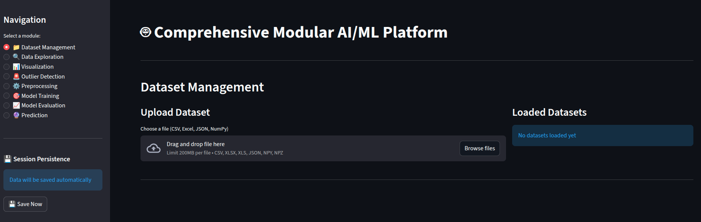

# Analytics-Workbench

A modular machine learning platform built with Python and Streamlit. Provides end-to-end ML workflows from data loading to model deployment.



## Features

### Dataset Management
- Support for multiple file formats (CSV, Excel, JSON, NumPy)
- Multi-dataset management in memory
- Missing value analysis and memory usage tracking

### Data Exploration
- Summary statistics and data type analysis
- Interactive correlation heatmaps
- Column-wise missing value reports

### Preprocessing
- **Missing Value Handling**: Mean, median, mode, or constant fill
- **Feature Scaling**: StandardScaler and MinMaxScaler
- **Categorical Encoding**: One-hot and label encoding
- **Train/Validation/Test Split**: Configurable split ratios

### Visualization
- Interactive histograms, box plots, scatter plots (Plotly)
- Correlation heatmaps
- Learning curve visualization

### Outlier Detection
- Z-Score, IQR, Isolation Forest, DBSCAN
- Option to remove or keep detected outliers

### Model Training

Supports 16 models across 3 frameworks:

| Framework     | Models                                                    |
|---------------|-----------------------------------------------------------|
| Scikit-Learn  | Linear Regression, Logistic Regression, Random Forest, Extra Trees, SVM, KNN |
| Keras         | MLP, CNN (1D), RNN, LSTM, GRU                            |
| PyTorch       | MLP, CNN (1D), RNN, LSTM, GRU                            |

**Task compatibility validation**: Models that only support classification (Logistic Regression) or only regression (Linear Regression) display an error and disable training when paired with an incompatible task. Dual-purpose models (Random Forest, SVM, KNN, all deep learning models) support both.

**Automatic label encoding**: For classification tasks, target labels are automatically remapped to contiguous 0-based indices so models work correctly with any label values (including negative or non-contiguous).

### Model Evaluation
- Classification: Accuracy, Precision, Recall, F1-score, Confusion Matrix
- Regression: MSE, RMSE, MAE
- Learning curves visualization

### Prediction
- Load saved models from disk (browse and select from available models)
- Choose target column to exclude from input and compare actual vs predicted
- Generate predictions on new CSV data
- Export predictions as CSV

### Model Persistence
- Save models directly from the Training page or Prediction page
- Model-name-prefixed files allow multiple models in the same directory:
  - Sklearn: `{model}_config.json` + `{model}_weights.pkl`
  - Keras: `{model}_config.json` + `{model}_weights.h5`
  - PyTorch: `{model}_config.json` + `{model}_weights.pth`
- Load any saved model by browsing the save directory and selecting from a dropdown

## Installation

### Prerequisites
- Python 3.11+
- pip

### Setup

1. **Create a virtual environment:**
```bash
cd analytics_workbench
python3 -m venv myenv
source myenv/bin/activate
```

2. **Install dependencies:**
```bash
pip install -r analytics_workbench/requirements.txt
```

3. **Generate sample datasets (optional):**
```bash
cd analytics_workbench/sample_data
python3 generate_samples.py
cd ..
```

## Usage

### Starting the Application

From the project root:
```bash
source myenv/bin/activate
streamlit run app.py
```


The application opens at `http://localhost:8501`.

### Workflow

1. **Dataset Management** - Upload CSV/Excel/JSON/NumPy data
2. **Data Exploration** - Summary statistics, correlations
3. **Preprocessing** - Missing values, scaling, encoding, train/val/test split
4. **Visualization** - Interactive plots
5. **Outlier Detection** - Detect and optionally remove outliers
6. **Model Training** - Select framework, model, hyperparameters, train, and save
7. **Model Evaluation** - Review metrics and learning curves
8. **Prediction** - Load a saved model, upload new data, select target column, predict

## Project Structure

```
analytics_workbench/
├── app.py                          # Main Streamlit application
├── requirements.txt                # Python dependencies
├── README.md                       # This file
├── QUICKSTART.md                   # Quick start guide
│
├── core/                           # Data processing modules
│   ├── data_loader.py              # Dataset loading and management
│   ├── preprocessing.py            # Missing values, scaling, encoding, splitting
│   ├── visualization.py            # Plotly-based visualizations
│   └── outliers.py                 # Outlier detection methods
│
├── models/                         # Model implementations
│   ├── __init__.py                 # Registry, factory, supported tasks map
│   ├── base_model.py              # Abstract base class (build/train/predict/save/load)
│   ├── sklearn/                    # Scikit-Learn models
│   │   ├── linear_regression.py    # Regression only
│   │   ├── logistic_regression.py  # Classification only
│   │   ├── random_forest.py        # Classification + Regression
│   │   ├── extra_trees.py          # Classification + Regression
│   │   ├── svm.py                  # Classification + Regression
│   │   └── knn.py                  # Classification + Regression
│   ├── keras/                      # Keras/TensorFlow models
│   │   ├── keras_mlp.py
│   │   ├── keras_cnn.py
│   │   ├── keras_rnn.py
│   │   ├── keras_lstm.py
│   │   └── keras_gru.py
│   └── pytorch/                    # PyTorch models
│       ├── pytorch_mlp.py
│       ├── pytorch_cnn.py
│       ├── pytorch_rnn.py
│       ├── pytorch_lstm.py
│       └── pytorch_gru.py
│
├── utils/
│   └── helpers.py                  # JSON/YAML/joblib save/load utilities
│
├── sample_data/                    # Sample datasets
│   ├── generate_samples.py
│   ├── iris.csv
│   ├── classification_dataset.csv
│   ├── regression_dataset.csv
│   └── timeseries_dataset.csv
│
├── saved_models/                   # Saved model weights and configs
└── session_data/                   # Session persistence (auto-generated)
```

## Architecture

### Design Principles

1. **Modularity** - Each component is independent and reusable
2. **Unified Model Interface** - All 16 models share the same `BaseModel` API: `build()`, `train()`, `predict()`, `save()`, `load()`, `evaluate()`, `get_config()`
3. **Registry Pattern** - `MODEL_REGISTRY` and `MODEL_SUPPORTED_TASKS` in `models/__init__.py` centralize model discovery and compatibility
4. **Session Persistence** - Streamlit session state preserves datasets, preprocessing pipelines, and trained models across page navigation

### Key Components

- **BaseModel** (`models/base_model.py`) - Abstract class all models inherit from
- **MODEL_REGISTRY** (`models/__init__.py`) - Maps model keys to classes
- **MODEL_SUPPORTED_TASKS** (`models/__init__.py`) - Maps model keys to `["classification"]`, `["regression"]`, or both
- **FRAMEWORK_MODELS** (`models/__init__.py`) - Groups models by framework for UI selection
- **Preprocessor** (`core/preprocessing.py`) - Handles missing values, scaling, encoding, splitting
- **Visualizer** (`core/visualization.py`) - Plotly-based interactive charts

## Troubleshooting

1. **Import Errors**: Install all dependencies with `pip install -r requirements.txt`
2. **GPU Not Detected**: The platform runs CPU-only by design (`CUDA_VISIBLE_DEVICES=""`)
3. **Port Already in Use**: `streamlit run analytics_workbench/app.py --server.port 8502`
4. **Keras load error** (`Could not deserialize`): Fixed - models load with `compile=False`
5. **Target out of bounds**: Fixed - labels are auto-encoded to 0..n-1 for classification

## Dependencies

| Category          | Libraries                                    |
|-------------------|----------------------------------------------|
| Data Science      | numpy, pandas, scikit-learn, scipy           |
| Deep Learning     | tensorflow (Keras), torch, torchvision       |
| Visualization     | plotly, matplotlib, seaborn                  |
| UI                | streamlit                                    |
| File Handling     | openpyxl, xlrd                               |
| Utilities         | joblib, pyyaml                               |

## License

This project is built for educational and professional use.
